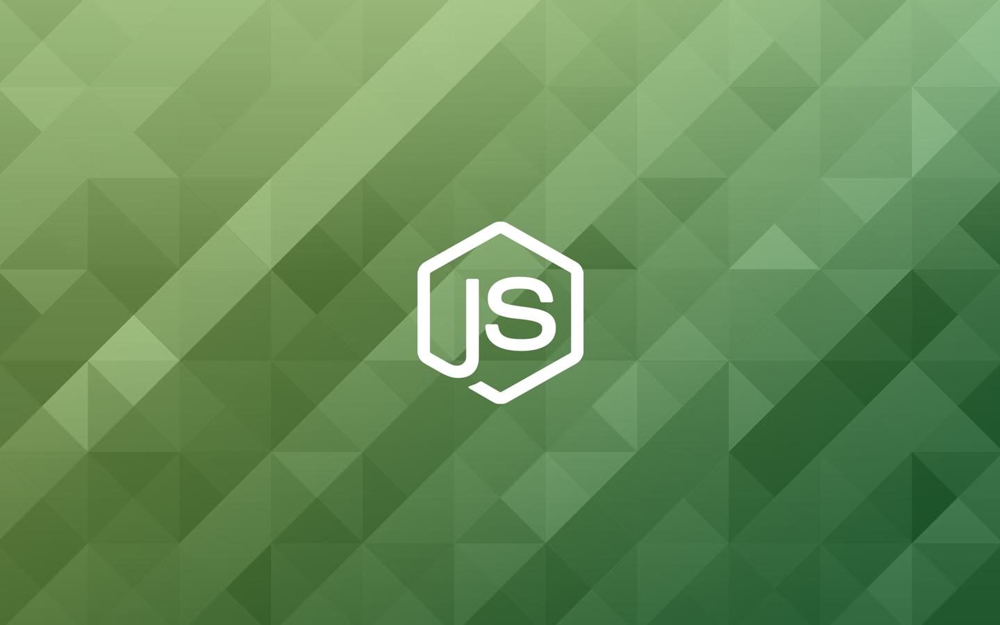
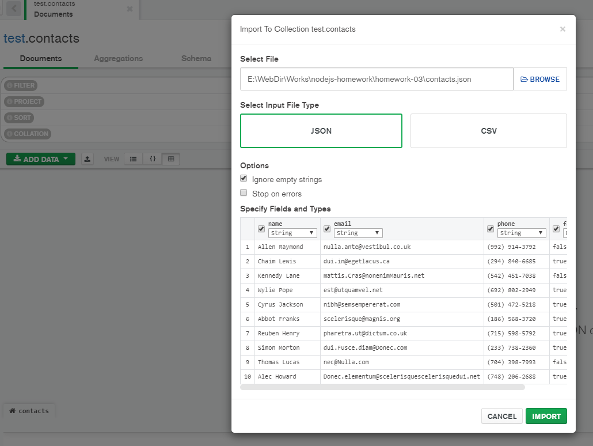

# GoIT Node.js Course Template Homework ---> npm run start:dev

Виконайте форк цього репозиторію для виконання домашніх завдань (2-6) Форк
створить репозиторій на вашому http://github.com

Додайте ментора до колаборації

Для кожної домашньої роботи створюйте свою гілку.

- hw02
- hw03
- hw04
- hw05
- hw06

Кожна нова гілка для др повинна робитися з master

Після того, як ви закінчили виконувати домашнє завдання у своїй гілці, необхідно
зробити пулл-реквест (PR). Потім додати ментора для рев'ю коду. Тільки після
того, як ментор заапрувить PR, ви можете виконати мердж гілки з домашнім
завданням у майстер.

Уважно читайте коментарі ментора. Виправте зауваження та зробіть коміт у гілці з
домашнім завданням. Зміни підтягнуться у PR автоматично після того, як ви
відправите коміт з виправленнями на github Після виправлення знову додайте
ментора на рев'ю коду.

- При здачі домашньої роботи є посилання на PR
- JS-код чистий та зрозумілий, для форматування використовується Prettier

### Команди:

- `npm start` &mdash; старт сервера в режимі production
- `npm run start:dev` &mdash; старт сервера в режимі розробки (development)
- `npm run lint` &mdash; запустити виконання перевірки коду з eslint, необхідно
  виконувати перед кожним PR та виправляти всі помилки лінтера
- `npm lint:fix` &mdash; та ж перевірка лінтера, але з автоматичними
  виправленнями простих помилок

---

# Домашнє завдання 2

Подивися пояснююче відео як це зробити та здавати ДЗ правильно:
[](https://www.youtube.com/watch?v=wabSW_sz_cM ' пояснення')

Написати REST API для роботи з колекцією контактів. Для роботи з REST API
використовуй [Postman] (https://www.getpostman.com/).

Прочитай уважно readme в клонованому темплейті, там описаний механізм здачі
домашніх завдань. Та починай виконувати ДЗ

## Крок 1

Створи гілку `hw02-express` з гілки master.

Встанови модулі командою

```bash
npm i
```

Такі модулі є в проекті:

- [express](https://www.npmjs.com/package/express)
- [morgan](https://www.npmjs.com/package/morgan)
- [cors](https://www.npmjs.com/package/cors)

## Крок 2

У `app.js` – веб сервер на `express` і прошарки `morgan` та `cors`. Почни
налаштовувати раутінг для роботи з колекцією контактів.

REST API повинен підтримувати такі раути.

### @ GET /api/contacts

- нічого не отримує
- викликає функцію `listContacts` для роботи з json-файлом `contacts.json`
- повертає масив всіх контактів в json-форматі зі статусом `200`

### @ GET /api/contacts/:id

- Не отримує `body`
- Отримує параметр `id`
- викликає функцію `getById` для роботи з json-файлом `contacts.json`
- якщо такий `id` є, повертає об'єкт контакту в json-форматі зі статусом `200`
- якщо такого `id` немає, повертає json з ключем `"message": "Not found"` і
  статусом `404`

### @ POST /api/contacts

- Отримує `body` в форматі `{name, email, phone}` (усі поля обов'язкові)
- Якщо в `body` немає якихось обов'язкових полів, повертає json з ключем
  `{"message": "missing required name field"}` і статусом `400`
- Якщо з `body` все добре, додає унікальний ідентифікатор в об'єкт контакту
- Викликає функцію `addContact(body)` для збереження контакту в файлі
  `contacts.json`
- За результатом роботи функції повертає об'єкт з доданим `id`
  `{id, name, email, phone}` і статусом `201`

### @ DELETE /api/contacts/:id

- Не отримує `body`
- Отримує параметр `id`
- Викликає функцію `removeContact` для роботи з json-файлом `contacts.json`
- якщо такий `id` є, повертає json формату `{"message": "contact deleted"}` і
  статусом `200`
- якщо такого `id` немає, повертає json з ключем `"message": "Not found"` і
  статусом `404`

### @ PUT /api/contacts/:id

- Отримує параметр `id`
- Отримує `body` в json-форматі з оновленням будь-яких полів
  `name, email и phone`
- Якщо `body` немає, повертає json з ключем `{"message": "missing fields"}` і
  статусом `400`
- Якщо з `body` все добре, викликає функцію `updateContact(contactId, body)`.
  (Напиши її) для поновлення контакту в файлі `contacts.json`
- За результатом роботи функції повертає оновлений об'єкт контакту і статусом
  `200`. В іншому випадку, повертає json з ключем `"message": "Not found"` і
  статусом `404`

## Крок 3

Для маршрутів, що приймають дані (`POST` та ` PUT`), продумайте перевірку
(валідацію) отриманих даних. Для валідації прийнятих даних використовуйте пакет
[joi](https://github.com/sideway/joi)

## Критерії прийому дз # 2-6

- Створено репозиторій з домашнім завданням &mdash; REST API додаток
- При створенні репозиторія використаний
  [бойлерплейт](https://github.com/goitacademy/nodejs-homework-template)
- Пулл-реквест (PR) з відповідним дз відправлений менторові на перевірку
  (посилання на PR)
- Код відповідає технічному завданню проекта
- При виконанні коду не виникає необроблених помилок
- Назва змінних, властивостей і методів починається з малої літери і записуються
  в нотації CamelCase. Використовуються англійські іменники
- Назва функції або методу містить дієслово
- У коді немає закоментуваних ділянок коду
- Проект коректно працює з актуальною LTS-версією Node

# Домашнє завдання 3

Створи гілку `03-mongodb` з гілки `master`.

Продовж створення REST API для роботи з колекцією контактів.

## Крок 1

Створи аккаунт на [MongoDB Atlas](https://www.mongodb.com/cloud/atlas). Після
чого в акаунті створи новий проект і налаштуй **безкоштовний кластер**. Під час
налаштування кластера вибери провавйдера і регіон як на скріншоті нижче. Якщо
вибрати занадто віддалений регіон, швидкість відповіді сервера буде довше.


## Крок 2

Установи графічний редактор
[MongoDB Compass](https://www.mongodb.com/products/compass) для зручної роботи з
базою даних для MongoDB. Налаштуй підключення своєї хмарної бази даних до
Compass. У MongoDB Atlas не забудь створити користувача з правами
адміністратора.

## Крок 3

Через Compass створи базу даних `db-contacts` і в ній колекцію `contacts`.
Візьми [посилання на json](./assets/contacts.json) і за допомогою Compass
наповни колекцію `contacts` (зроби імпорт) його вмістом.



Якщо ви все зробили правильно, дані повинні з'явитися у вашій базі в колекції
`contacts`


## Крок 4

Використовуй вихідний код [домашньої роботи #2](../homework-02/README.md) і
заміни зберігання контактів з json-файлу на створену тобою базу даних.

- Напиши код для створення підключення до MongoDB за допомогою
  [Mongoose](https://mongoosejs.com/).
- При успішному підключенні виведи в консоль повідомлення
  `"Database connection successful"`.
- Обов'язково обробив помилку підключення. Виведи в консоль повідомлення помилки
  і заверши процес використовуючи `process.exit(1)`.
- У функціях обробки запитів заміни код CRUD-операцій над контактами з файлу, на
  Mongoose-методи для роботи з колекцією контактів в базі даних.

Схема моделі для колекції `contacts`:

```js
  {
    name: {
      type: String,
      required: [true, 'Set name for contact'],
    },
    email: {
      type: String,
    },
    phone: {
      type: String,
    },
    favorite: {
      type: Boolean,
      default: false,
    },
  }
```

## Крок 5

У нас з'явилося в контактах додаткове поле статусу `favorite`, яке приймає
логічне значення` true` або `false`. Воно відповідає за те, що в обраному чи ні
знаходиться зазначений контакт. Потрібно реалізувати для оновлення статусу
контакту новий роутер

### @ PATCH /api/contacts/:id/favorite

- Отримує параметр `contactId`
- Отримує `body` в json-форматі з оновленням поля` favorite`
- Якщо `body` немає, повертає json з
  ключем`{ "message": "missing field favorite"}`і статусом` 400`
- Якщо з `body` все добре, викликає
  функцію` updateStatusContact (contactId, body)` (напиши її) для поновлення
  контакту в базі)
- За результатом роботи функції повертає оновлений об'єкт контакту і статусом
  `200`. В іншому випадку, повертає json з ключем `" message ":" Not found "` і
  статусом `404`

Для роута `POST /api/contacts` внеси зміни: якщо поле `favorite` не вказали в
`body`, то при збереженні в базу нового контакту, зроби поле `favorite` рівним
за замовчуванням `false`
